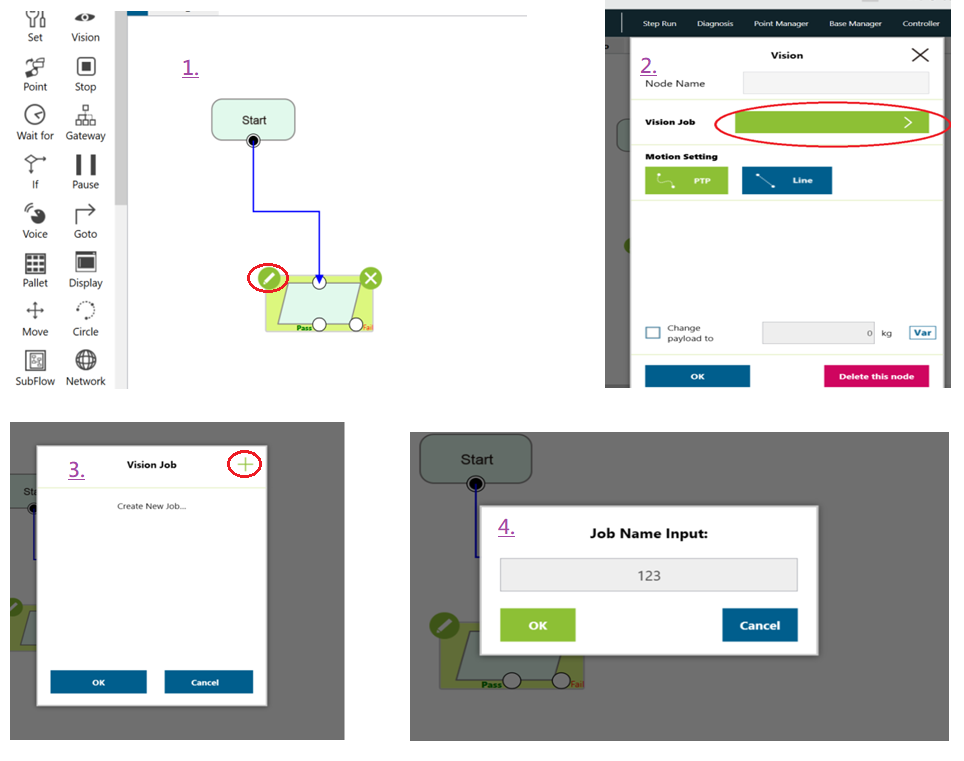
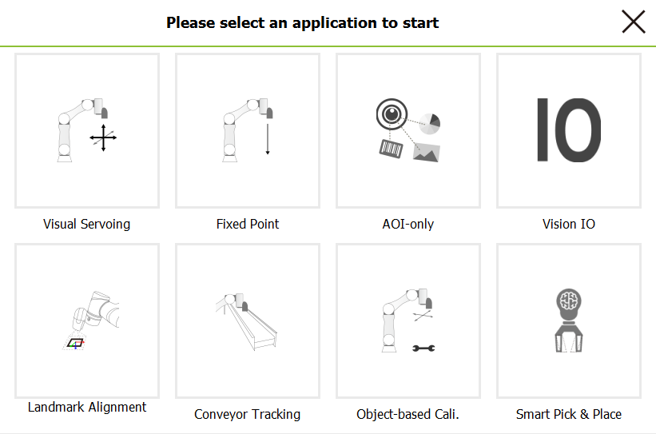
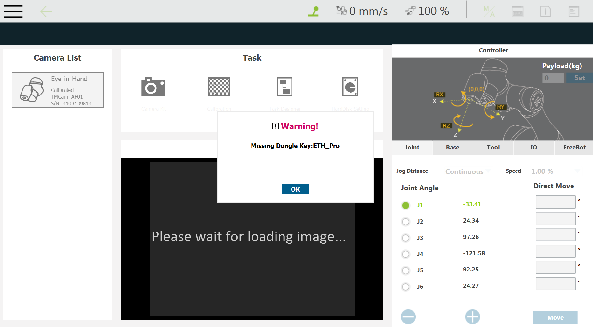
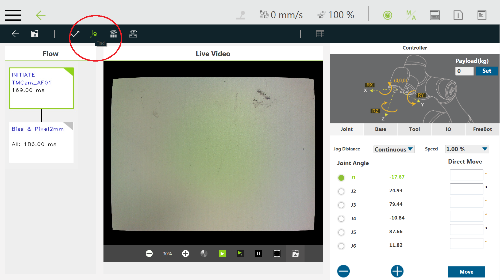
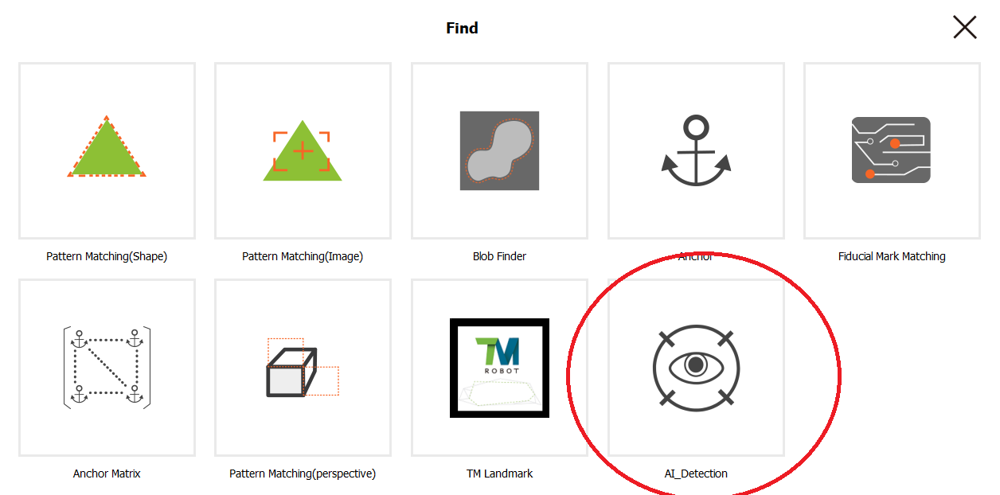
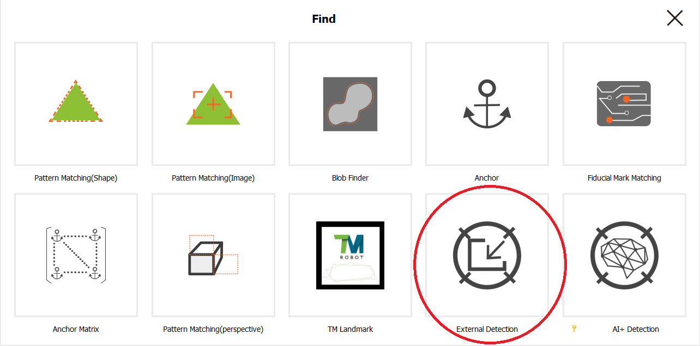
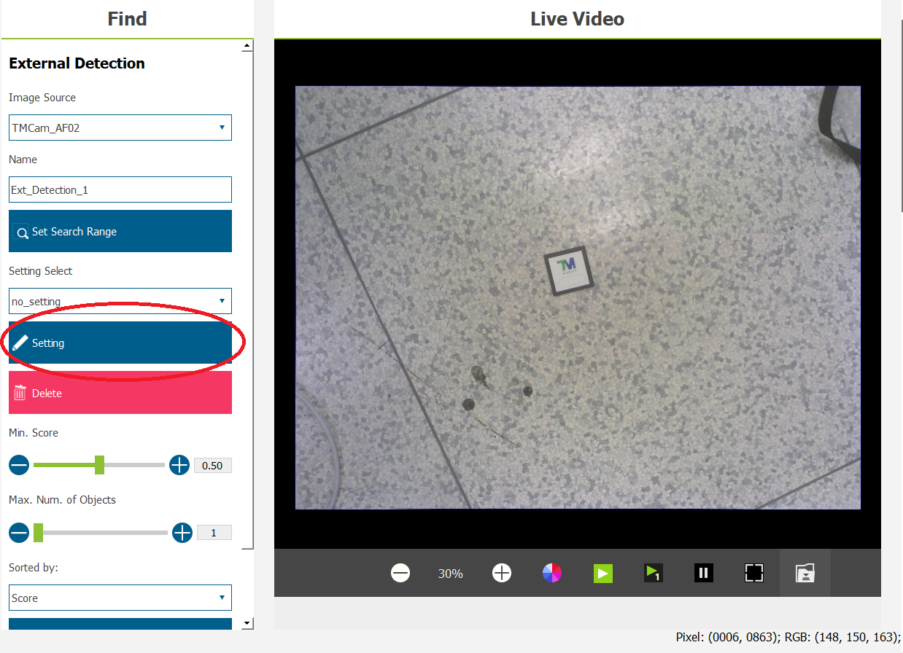
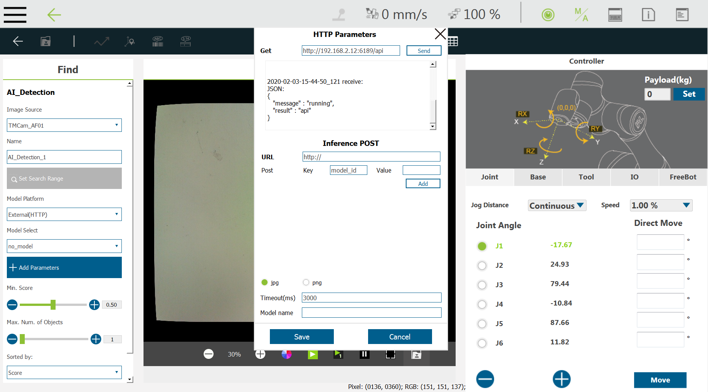
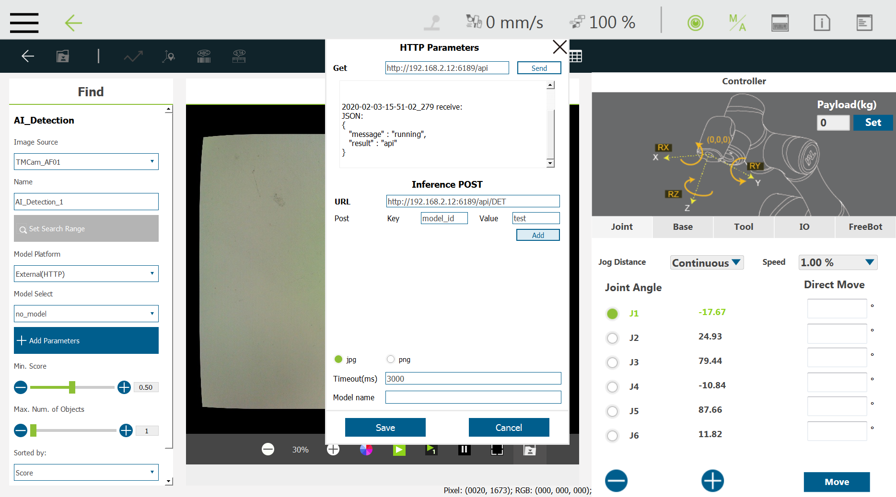
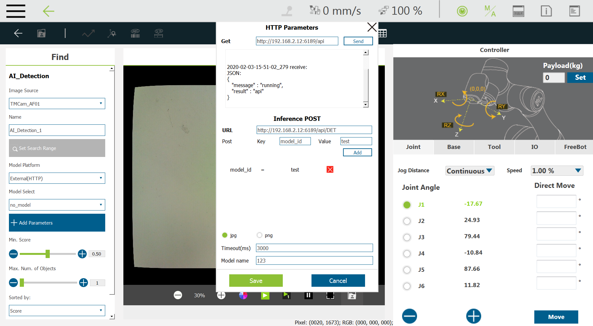

# __TM ROS Driver__

## __1. Overview__

Techman Robot is a state-of-the-art production tool that is highly compatible and flexible to collaboration between human and machine. The Robot Operating System (ROS) provides abundant libraries and tools which can be utilized to reduce the cost of trivial development software tool and build robot applications without struggling. Our TM ROS driver provides nodes for communication with Techman Robot controllers, data including robot states, images from the eye-in-hand camera and URDF models for various robot arms via _TMflow_.

## __2. Feature__

This driver is for <u>**ROS1 Noetic**</u> version.<br/>
To use the driver, make sure your ROS PC is installed correctly.<br/>
If the user wants to know how to use the ROS2 driver, please visit the [TM ROS2 driver](https://github.com/TechmanRobotInc/tmr_ros2) website or directly click on the listed `Github repo: TM App Release` below ROS2 projects in the table.<br/>


More information: TM ROS driver support list
<table>
<head>
</head>
    <tr>
        <th colspan="5">TMflow + TM Robot Series </th>
    </tr>
    <tr>
        <th>ROS Distro</th>
        <th>GitHub repo: TM App Release</th>
        <th>TM ROS Driver</th>
        <th>TMvision Support</th>
        <th>GitHub Branch</th>
    </tr>
    <tr>
        <td><a href="http://wiki.ros.org/melodic">ROS Melodic Morenia</a></td>
        <td><a href="https://github.com/TechmanRobotInc/tmr_ros1/">TM ROS1 Melodic</a></td>
        <th>&#9711;</th>
        <th>&#10005;&nbsp</th>
        <th>master</th>
    </tr>
    <tr>
        <td><a href="http://wiki.ros.org/noetic">ROS Noetic Ninjemys</a></td>
        <td><a href="https://github.com/TechmanRobotInc/tmr_ros1/tree/noetic">TM ROS1 Noetic</a></td>
        <th>&#9711;</th>
        <th>&#9711;</th>
        <th>noetic</th>
    </tr>
    <tr>
        <td><a href="https://index.ros.org/doc/ros2/Releases/Release-Dashing-Diademata/">ROS 2 Dashing Diademata</a></td>
        <td><a href="https://github.com/TechmanRobotInc/tmr_ros2/tree/dashing">TM ROS2 Dashing</a></td>
        <th>&#9711;</th>
        <th>&#9711;</th>
        <th>dashing</th>
    </tr>
    <tr>
        <td><a href="https://index.ros.org/doc/ros2/Releases/Release-Foxy-Fitzroy/">ROS 2 Foxy Fitzroy</a></td>
        <td><a href="https://github.com/TechmanRobotInc/tmr_ros2">TM ROS2 Foxy</a></td>
        <th>&#9711;</th>
        <th>&#9711;</th>
        <th>master</th>
    </tr>
    <tr>
        <td><a href="https://docs.ros.org/en/humble/index.html">ROS 2 Humble Hawksbill</a></td>
        <td><a href="https://github.com/TechmanRobotInc/tmr_ros2/tree/humble">TM ROS2 Humble</a></td>
        <th>&#9711;</th>
        <th>&#9711;</th>
        <th>humble</th>
    </tr>
    <tr>
        <th colspan="5">TMflow 2 + TM AI Cobot S-Series </th>
    </tr>
    <tr>
        <th>ROS Distro</th>
        <th>GitHub repo: TM 2 App Release</th>
        <th>TM ROS Driver</th>
        <th>TMvision Support</th>
        <th>GitHub Branch</th>
    </tr>
    <tr>
        <td><a href="https://index.ros.org/doc/ros2/Releases/Release-Foxy-Fitzroy/">ROS 2 Foxy Fitzroy</a></td>
        <td><a href="https://github.com/TechmanRobotInc/tm2_ros2">TM2 ROS2 Foxy</a></td>
        <th>&#9711;</th>
        <th>&#9711;</th>
        <th>master</th>
    </tr>
    <tr>
        <td><a href="https://docs.ros.org/en/humble/index.html">ROS 2 Humble Hawksbill</a></td>
        <td><a href="https://github.com/TechmanRobotInc/tm2_ros2/tree/humble">TM2 ROS2 Humble</a></td>
        <th>&#9711;</th>
        <th>&#9711;</th>
        <th>humble</th>
    </tr>
</table>


Note: The `Github repo: TM 2 App Release` applies to TMflow Version 2.14 or above and adapts to HW5.0 mainly.<br/>


### __ROS1 Driver__

The TM ROS driver connects to _TMflow Ethernet Slave_ to control _TMflow project_. The robot state is transmitted through this connection.  A working driver also connects to a _Listen node_ (running at a _TMflow project_) at the same time. To control the robot locomotion, IO, etc., the TM ROS driver sends the robot script (_TM Robot Expression_) through this connection.
More information about _TM Robot Expression_ and _Ethernet Slave_, see [Expression Editor and Listen Node.pdf](https://assets.omron.eu/downloads/manual/en/v1/i848_tm_expression_editor_and_listen_node_reference_manual_en.pdf).
The TM ROS driver for ROS1 is a __single ROS node__ that creates a ROS interface such as topics and services:

> __Action Server__
>
> - An action interface on _/follow_joint_trajectory_ for seamless integration with MoveIt
>
> __Topic Publisher__
>
> - publish feedback state on _/feedback_states_  
The FeedbackState includes robot position, error code, and io status, etc.
(see _tm_msgs/msg/FeedbackState.msg_)  
> - publish joint states on _/joint_states_  
> - publish tool pose on _/tool_pose_
>
> __Service Server__
>
> - _/tm_driver/send_script_ (see _tm_msgs/srv/SendScript.srv_) :  
send robot script (_TM Robot Expression_) to _Listen node_  
> - _/tm_driver/set_event_ (see _tm_msgs/srv/SetEvent.srv_) :  
send "Stop", "Pause" or "Resume" commands to _Listen node_  
> - _/tm_driver/set_io_ (see _tm_msgs/srv/SetIO.srv_) :  
send digital or analog output value to _Listen node_  
> - _/tm_driver/set_position (see _tm_msgs/srv/SetPosition.srv_) :  
send motion command to _Listen node_, the motion type include PTP, LINE, CIRC, and PLINE, the position value is a joint angle(__J__) or tool pose(__T__), see [[Expression Editor and Listen Node.pdf]]
>
>

### __Installation__
Just clone the TM ROS driver of the git repository into your working directory and then build it.<br/>
The user can directly refer to the chapters introduced in the following text: steps 1 to 4 of __&sect; Usage with demo code & driver__.<br/>


## __3. Usage__
The TM ROS driver is designed to interface the TM Robot's operating software (__TMflow__) with the Robot Operating System (ROS) so that program developers and researchers can build and reuse their own programs to control the TM robot externally.

After installing the correct ROS version of the computer, the next step is to ensure that your hardware, control computer, and TM Robot are all properly configured to communicate with each other. See below to make sure the network settings on your computer are correct, the TM Robot's operating software (__TMflow__) network settings are ready and the __Listen node__ is running.<br/>

### &sect; __TMflow Listen node setup__
> The __Listen node__: a socket server can be established and be connected with ROS by an external device to communicate according to the [defined protocol](https://assets.omron.eu/downloads/manual/en/v1/i848_tm_expression_editor_and_listen_node_reference_manual_en.pdf). The user can make the robot communicate with the user's ROS (remote) computer equipment through a wired network when all the network parameters in the _Network setting_ are set.<br/>
>
> 1. Create a _Listen task_ of flow project of __TMflow__ software, and then drag the __Listen node__ from the _nodes menu_ onto the project flow, as shown below.
> [](https://www.youtube.com/watch?v=LuKE2wVNn5Y)
>
> 2. Set the `Network` settings: mouse-click to enter the page of __System &rArr; Network__ in order.  
Example: Set the Subnet mask: to 255.255.255.0 and IP address 192.168.10.2  
**Note**: Set the network mask, and the communication with the TM Robot must be in the set domain.  
> 
>
> 3. Set the __Ethernet Slave__ `Data Table Setting` item: mouse-click to enter the page of __Setting &rArr; Connection &rArr; Ethernet Slave__ in order.  
We recommend _one easy method_ <sup>1</sup> to set the __Ethernet Slave__ `Data Table setting` is to directly import the software package.  
 <sup>1</sup> See [TM ROS Driver vs TMflow Software Usage: Import Data Table Setting](https://github.com/TechmanRobotInc/TM_Export).  
 Or the previously provided method as follows:  (Note: TMflow software version changes may have slightly different settings.)  
The user can manually click the `Data Table Setting` <sup>2</sup> item and check the following boxes as item _predefined_ <sup>3</sup> to receive/send specific data: 
>
>       - [x] Robot_Error
>       - [x] Project_Run
>       - [x] Project_Pause
>       - [x] Safeguard_A
>       - [x] ESTOP
>       - [x] Camera_Light
>       - [x] Error_Code
>       - [x] Joint_Angle
>       - [x] Coord_Robot_Flange
>       - [x] Coord_Robot_Tool
>       - [x] TCP_Force
>       - [x] TCP_Force3D
>       - [x] TCP_Speed
>       - [x] TCP_Speed3D
>       - [x] Joint_Speed
>       - [x] Joint_Torque
>       - [x] Project_Speed
>       - [x] MA_Mode
>       - [x] Robot Light
>       - [x] Ctrl_DO0~DO7
>       - [x] Ctrl_DI0~DI7
>       - [x] Ctrl_AO0
>       - [x] Ctrl_AI0~AI1
>       - [x] END_DO0~DO3
>       - [x] END_DI0~DI2
>       - [x] END_AI0
>
>    <sup>2</sup> <u>Turn off</u> Ethernet Slave. Let "STATUS:   __Disable__" be displayed on the Ethernet Slave setting page, then click `Data Table Setting` to enter the next page for related settings.  
>    <sup>3</sup> The checked items listed above must <u>all</u> be selected for TM ROS setting.
>
>    When you need to check more about the maximum, minimum, and average calculation properties of joint torque, the _three checked items_ <sup>4</sup> listed below can be checked individually or all of them, please leave them unchecked when not in use.
>
>       - [ ] Joint_Torque_Average
>       - [ ] Joint_Torque_Min
>       - [ ] Joint_Torque_Max
>
>    <sup>4</sup> This function requires <u>TMflow 1.84 or later</u> versions to support.
>
> 4. Enable the __Ethernet Slave__ settings: mouse-click to enable or disable TM Ethernet Slave. Once enabled, the robot establishes a Socket server to send the robot status and data to the connected clients and permissions to access specific robot data.<br/>
> Mouse-click to enable the `Ethernet Slave` setting and let `STATUS:` &rArr; __`Enable`__. 
>       
>
> 5. Press the Play/Pause Button on the Robot Stick to start running this _Listen task_ project.
>
>     Note: Software TMflow version changes may have slightly different settings. ([SW1.76_Rev2.00](https://www.tm-robot.com/zh-hant/wpdmdownload/software-manual-tmflow_sw1-76_rev2-00/)) ([SW1.82_Rev1.00](https://www.tm-robot.com/zh-hant/wpdmdownload/software-manual-tmflow_sw1-82_rev1-00/))<br/>


###  &sect; __Remote connection to TM ROBOT__
> Static IP of remote connection network settings through the wired network.<br/> 
>
> 1. Set the wired network of the user's (remote) Ubuntu computer by mouse-click on the top right of the desktop &rArr; Click on "__Wired Settings__" &rArr; Click on the gear icon &rArr; In the IPv4 feature options, click on "Manual" in order.<br/> 
> 
> 2. Set the Static IP settings: where the IP address is fixed for the first three yards same as the previous setting 192.168.10, last yards 3-254 machine numbers are available. (Because _TM ROBOT_, you have been set to 192.168.10.2)<br/> 
> Example: Set the Netmask: 255.255.255.0 and IP address 192.168.10.30 <br/> 
> 
> 3. Check Internet connection: start a terminal to test the connectivity with the target host _TM ROBOT_, by typing ping 192.168.10.2
> 
>> :bulb: **Tip**: Remember to reconfigure the network settings due to <u>static IP changes</u> or <u>replacement of the ROS control PC</u>.<br/>
>> As mentioned above, a valuable debugging tool is your operating system's <u>ping</u> command. If nothing appears to happen or an error is thrown, the robot cannot be accessed from your computer. Please go back to the top of this chapter and re-operate in the order of instructions.<br/>
>> If you are an experienced user, you may just need to <u>turn off</u> &rArr; <u>turn on</u> the gear icon of "__Wired Settings__" on your computer or to <u>turn off</u> &rArr; <u>turn on</u> the "__Ethernet Slave Data Table__" setting of the robot to reconfigure the hardware settings.<br/>
>


###  &sect; __TM ROS driver usage__
> __ROS1 driver usage__
> 
> After the user has set up the ROS1 environment and built the TM driver based on the specific workspace, please enter your workspace `<workspace>` by launching the terminal, and remember to make the workspace visible to ROS.
>
>
> ```bash
> source /opt/ros/noetic/setup.bash
> cd <workspace>
> source ./devel/setup.bash
> ```
> :bulb: Do you prepare the __TM Robot__ ready ? Make sure that TM Robot's operating software (__TMflow__) network settings are ready and the __Listen node__ is running. 
> 
> Then, run the driver to maintain the connection with TM Robot by typing 
>
>```bash
> rosrun tm_driver tm_driver <robot_ip_address>
>```
> Example :``rosrun tm_driver tm_driver 192.168.10.2``, if the <robot_ip_address> is 192.168.10.2
>
> Now, the user can use a new terminal to run each ROS node or command but don't forget to source the correct setup shell files as starting a new terminal.

> __Usage with MoveIt__ 
>
> See [Moveit tutorial](https://ros-planning.github.io/moveit_tutorials/) to install the MoveIt packages.<br/>
>
> :bulb: Do you prepare the __TM Robot__ ready ? Make sure that TM Robot's operating software (__TMflow__) network settings are ready and the __Listen node__ is running.<br/>
> **Note**: The following directive settings vary slightly due to package changes. The earlier TM ROS1 TM5, TM12, TM14 descriptions, and related moveit_config packages were migrated to [another](https://github.com/TechmanRobotInc/earlier-descriptions) repository.<br/>
>
> To bring up the MoveIt environment in simulation mode with virtual TM Robot (Example: TM5-900), by typing<br/>
>
>
> ```bash
> roslaunch tm5-900-moveit_config tm5-900_moveit_planning_execution.launch sim:=True
> ```
>
> Or with virtual TM Robot (Example: TM5X-900 the eyeless model), by typing<br/>
>
>
> ```bash
> roslaunch tm5x-900-moveit_config tm5x-900_moveit_planning_execution.launch sim:=True
> ```
> :bookmark_tabs: Note1: There are several built-in TM Robot nominal robot model settings, available for tm5-900, tm5-700, tm12 and tm14 models, as well as the eyeless models tm5x-900, tm5x-700, tm12x and tm14x models.<br/>
> <br/>
>
> The user can also manipulate real TM5-900 Robot (Example: TM5-900) to run, by typing<br/>
>> :warning:[CAUTION] This demo will let the real TM Robot move, please be careful.<br/>
>
> ```bash
> roslaunch tm5-900-moveit_config tm5-900_moveit_planning_execution.launch sim:=False robot_ip:=<robot_ip_address>
> ```
>
> Or TM Robot (Example: TM5X-900 the eyeless model), by typing<br/>
>
> ```bash
> roslaunch tm5x-900-moveit_config tm5x-900_moveit_planning_execution.launch sim:=False robot_ip:=<robot_ip_address>
> ```
>
> The parameter `<robot_ip_address>` means the IP address of the TM Robot.<br/>
> :bookmark_tabs: Note2: If your real Robot is a TM12, in the above example, you should type "tm12-moveit_config" to instead of "tm5-900-moveit_config" and type "tm12_moveit_planning_execution.launch" to instead of "tm5-900_moveit_planning_execution.launch".<br/>
> :bookmark_tabs: Note3: If your real Robot is the eyeless model as a TM12X, in the above example, you should type "tm12x-moveit_config" to instead of "tm5x-900-moveit_config" and type "tm12x_moveit_planning_execution.launch" to instead of "tm5x-900_moveit_planning_execution.launch".<br/>
> :bookmark_tabs: Note4: In MoveIt planning_context.launch, TM Robot set the default to read the Xacro file, such as _TM5-900_ model, to read the file _tm5-900.urdf.xacro_ into robot_description or such as _TM12_ model, to read the file _tm12.urdf.xacro_ into robot_description. If the user wants to use the specific model parameters instead of the nominal model to control the robot, please refer to the following section __Take generating a new Xacro file as an example__ of chapter 6 to modify the Xacro file.<br/>

> __Usage with Gazebo Simulation__ 
>
> See [Gazebo tutorial](https://classic.gazebosim.org/tutorials?tut=ros_installing&cat=connect_ros) to install the Gazebo packages.<br/>
>> Then, install the other joint_trajectory_controller plugin: <br/>
`` sudo apt-get install ros-noetic-joint-trajectory-controller``<br/>
`` sudo apt-get install ros-noetic-rqt-joint-trajectory-controller``<br/>
>
> The tm_gazebo package contains the URDF/Xacro/SDF model files to simulate the TM Robot in Gazebo.
>
> A simple SDF model demonstrating the generation of a virtual TM robot to Gazebo using `rosrun` command, by typing
> To open the terminal 1: Startup ROS core
> ```bash
> roscore
> ```
> In a new terminal 2: Source ROS environment settings, specify the model database path for Gazebo, then run Gazebo with ROS. 
> ```bash
> source /opt/ros/noetic/setup.bash
> cd <workspace>
> catkin_make
> source ./devel/setup.bash
> export GAZEBO_MODEL_PATH=~/<workspace>/src/tm_gazebo/models/
> rosrun gazebo_ros gazebo
> ```
> 3. In another new terminal 3: Source ROS environment settings, then spawn TM Robot model (Example: TM5-900) in Gazebo.
> ```bash
> source /opt/ros/noetic/setup.bash
> cd <workspace>
> source ./devel/setup.bash
> rosrun gazebo_ros spawn_model -database tm5-900 -sdf -model tm5-900 -x 0 -y 0 -z 0
> ```
>
> Or directly to bring up the Gazebo environment in simulation paused mode with a virtual TM5-900 robot using `roslaunch` command in a terminal, by typing
>> Note: When opening each terminal, don't forget to set up the ROS environment first.
>
> ```bash
> roslaunch tm_gazebo tm5-900_gazebo_example.launch
> ```
>
> There are several built-in launch files that can be used to start the TM Robot simulated robot using the nominal Xacro robot model settings in Gazebo.
> The common command's form to bring up the TM simulated robot in Gazebo as follows: 
>
> ```bash
> roslaunch tm_gazebo <tm_robot_type>_gazebo.launch
> ```
>
> The prefix `<tm_robot_type>` means the TM Robot type, available for the tm5-900, tm5-700, tm12, and tm14 models, as well as the eyeless models tm5x-900, tm5x-700, tm12x, and tm14x models.<br/>
> For the TM5-900 Robot, simply replace the prefix accordingly to tm5-900 and type "``roslaunch tm_gazebo tm5-900_gazebo.launch``".<br/>
> :bookmark_tabs: Note1: If your real Robot is a TM12, in the above example, you should type tm12_gazebo.launch.<br/>
> :bookmark_tabs: Note2: If the user needs to improve end-point simulation accuracy, please refer to the following section __Take generating a new Xacro file as an example__ of chapter 6 to modify the Xacro file.<br/>

> __Using Moveit! with Gazebo Simulator__
>
>  You can also use MoveIt! to control the simulated robot which is configured to run alongside Gazebo.
> 
> 1. Launch the Gazebo simulation and load the ros_control controllers:
> ```bash
> roslaunch tm_gazebo <tm_robot_type>_gazebo.launch
> ```
> After the Gazebo simulator is running, proceed to the next command to launch moveit!.
> 
> 2. Launch the combined of moveit! and Gazebo to allow motion planning plugin run:
> ```bash
> roslaunch <tm_robot_type>-moveit_config <tm_robot_type>_moveit_planning_execution_gazebo.launch
> ```
> Taking the TM5-900 robot as an example, use the commands introduced above:
> Note: If you have started some executable programs with ROS commands in some terminal windows, it is recommended that you close them and then execute the following commands.
> 1. To open the terminal 1: Running with Gazebo<br/>
``source /opt/ros/noetic/setup.bash``<br/>
``cd <workspace>``<br/>
``source ./devel/setup.bash``<br/>
``roslaunch tm_gazebo tm5-900_gazebo.launch``<br/>
> 
> 2. In a new terminal 2: Running with moveit!<br/>
``roslaunch tm5-900-moveit_config tm5-900_moveit_planning_execution_gazebo.launch``<br/>
>
> :bookmark_tabs: Note1: Remember to close all these executables when you no longer use them for Gazebo simulations.<br/>
> :bookmark_tabs: Note2: Sometimes when gzserver is not properly shut down with ROS or cannot run Gazebo again after shutting down, you can try to kill the corresponding process with the following command.<br/>
>>:bulb: **Tip**: To kill both the Gazebo server and Gazebo client executables.<br/>
>> ``sudo killall -9 gazebo gzserver gzclient``<br/>
>


## __4. Vision__

### &sect; __TM ROS Vision usage__
> This chapter describes that the user can get image data through TMvision&trade; of TM Robot. **(Built-in Vision System)**  
>
> __Dependencies__
>
> - ROS1 Noetic
> - Python packages:
>   1. flask
>   2. waitress
>   3. opencv-python==3.4.13.47 (Minimum)
>   4. numpy
>   5. datetime  
>
>    For example, install Python3 packages: 
>      *  pip3 install flask
>      *  pip3 install waitress
>      *  pip3 install opencv-python
>      *  pip3 install datetime
>
> __Techman Robot Vision__
>
> - type: sensor_msgs::Image
> - message name: techman_image
>
> __Build TM ROS Vision driver node on your (remote) computer__
>
> Please open two terminals
> Terminal 1: Startup ROS core and type<br/>
> ``roscore``<br/>
>
> In a new terminal 2: Under the environment settings have been finished with your workspace`<workspace>`, then type
>
> ```bash
> cd ~/<workspace> && source ./devel/setup.bash
> python3 ./src/tm_image/script/image_talker.py
> ```
>
> :bulb: The user can check whether the connection succeeds or not. When you proceed to the following steps introduced in the following text: steps 6 of § TMflow Vision node setup.


### &sect; __TMflow Vision node setup__
> The __Vision node__ provides the creation of a plane with fixed-point type, servo type, and object type as well as a variety of AOI identification functions.<br/>
> :bulb: Before going through the following steps, please build the TM ROS Vision driver node on your (remote) computer and then connect this (remote) computer to the local TM Robot computer.
>
> 1. Create a _Vision task_ project of __TMflow__ software, and then drag the __Vision node__  from the _nodes menu_ onto the project flow, as shown below.<br/>
> 
> 2. Click the __AOI -only__ icon, and then follow the steps below to handle some settings related to accessing TM Robot HMI.<br/>
> 
>
>    TMflow 1.76 second version only:<br/> 
> If no suitable dongle is detected, warning alerts will be displayed in the window.<br/>
> 
> TMflow 1.80 version: <br/>
> The user doesn't need a dongle to activate this function.
>
> 3. Click the __Find__ icon.
> 
>
> 4. In TMflow 1.76 second version, click the __AI_Detection__ icon.<br/>
> 
> In TMflow 1.80 version, click the __External Detection__ icon.
> 
>
> 5. In TMflow 1.76 second version, click the __+ Add Parameters__ button.
> 
> In TMflow 1.80 version, click the __Setting__ button.
> 
>
> 6. To check whether the connection succeeds or not, please enter ``<user_pc_ip_address>:6189/api`` in the __HTTP Parameters__ blank text and click the __Send__ button to get the information of the (remote) computer for ROS.<br/>
> The `<user_pc_ip_address>` means the IP address of the user's (remote) ROS computer, for example, 192.168.2.12<br/>
> 
>
>    If the connection fails, a __TIMEOUT__ error will be displayed in the window
> 
>
>    If the IP address of the user's (remote) ROS computer doesn't exist, **ERROR_CODE_7** will be displayed in the window.
> 
> 7. Enter ``<user_pc_ip_address>:6189/api/DET`` in the URL blank text and type arbitrary letters in the __Value__ blank text; the __Key__ will be generated automatically.
> 
> 8. Assign a name to the model in  the __Model name__ blank text and click the __Save__ button.
> 
>
> 9. Press the Play/Pause Button on the Robot Stick to start running this _Vision task_ project.
>
>    Note: TMflow software version changes may have slightly different settings. ([SW1.76_Rev2.00](https://www.tm-robot.com/zh-hant/wpdmdownload/software-manual-tmflow_sw1-76_rev2-00/)) ([SW1.80_Rev2.00](https://www.tm-robot.com/zh-hant/wpdmdownload/software-manual-tmflow_sw1-80_rev2-00-2/))<br/>


###  &sect; __Receive image data on the user's computer from TMflow Vision node__
> :bulb: Do you prepare the TM Robot ready? Make sure that TM Robot's operating software (TMflow) relative __HTTP Parameters__ Vision settings are ready and the _Vision task_ project is running.<br/>
>
> Now, in a new terminal of your (remote) ROS computer: Source setup.bash in the workspace path and run to get image data from TMvision&trade; by typing
>
> ```bash
> source ./devel/setup.bash
> rosrun image_sub sub_img
> ```
>
> Then, the viewer will display image data from _TMflow_.


## __5. Program script demonstration__

### &sect; __Demo package description__
> This chapter describes the _demo_ package and the code used as a C++ programming example, showing how to program robot scripts (TM Robot Expressions) through the TM ROS driver connection. <br/>
>
> * demo_send_script:<br/>
In this demo code, it shows how to send a __Listen node__ script to control the TM Robot. <br/>
The user can use a service named "send_script" to send the script.<br/>
"id" &rarr; The transaction number expressed in any <u>alphanumeric</u> <sup>1</sup> characters.<br/> 
"script" &rarr; the script that the user wants to send.<br/>
"ok" &rarr; the correctness of the script.<br/>
> <sup>1</sup> If a non-alphanumeric byte is encountered, a CPERR 04 error is reported. When used as a communication packet response, it is a transaction number and identifies which group of commands to respond.<br/>
>
> * demo_ask_item:<br/>
In this demo code, the user can use this service to send TMSVR <sup>2</sup> cmd.<br/> 
> <sup>2</sup> For more detailed information, please refer to _defined protocol_: Expression Editor and Listen Node.pdf (Chapter 9.6 TMSVR)<br/>
>
> * demo_ask_sta:<br/>
In this demo code, the user can use this service to send TMSTA <sup>3</sup> cmd.<br/>
> <sup>3</sup> For more detailed information, please refer to _defined protocol_ (Chapter7.5 TMSTA)<br/>
> * demo_connect_tm:<br/>
In this demo code, the user can set the connection type. <br/>
If the user sets reconnect to true, every time the driver disconnects from the __Listen node__, it will try to reconnect.<br/>
There are two kinds of connection settings the user can select, one is "connect_tmsvr" for Ethernet server connection, and the other is "connect_tmsct" for  TMflow connection.<br/>
>
> * demo_set_event:<br/>
In this demo code, six event types can be selected.<br/> 
func &rarr;  TAG, WAIT_TAG, STOP, PAUSE, RESUME and EXIT<br/>
arg0 &rarr;  if func is TAG or WAIT_TAG, arg0 is the tag number<br/>
arg1 &rarr;  if func is TAG or WAIT_TAG, arg1 is timeout in ms<br/>
>
> * demo_set_io:<br/>
In this demo code, the user should set the module, type, pin, and state. <sup>4</sup> <br/>
module &rarr;  MODULE_CONTROLBOX or MODULE_ENDEFFECTOR<br/>
type &rarr;  TYPE_DIGITAL_IN, TYPE_DIGITAL_OUT, TYPE_INSTANT_DO, TYPE_ANALOG_IN, TYPE_ANALOG_OUT, TYPE_INSTANT_AO<br/>
pin &rarr;  pin number<br/>
state &rarr;  STATE_OFF or STATE_ON value, or other value (if type expressed in a specific control module)<br/>
> <sup>4</sup> For more detailed information, please refer to _defined protocol_ (Chapter6.5 IO)<br/>
>
> * demo_set_positions:<br/>
In this demo code, the user should pay attention to the parameter definition of the data format setting <sup>5</sup> and the unit of the parameter to be operated.  <br/>
motion_type &rarr;  PTP_J , PTP_T , LINE_J , LINE_T , CIRC_J ,CIRC_T , PLINE_J ,PLINE_T <br/>
positions &rarr;  motion target position: If expressed in Cartesian coordinate (unit: m), if expressed in joint angles (unit: rad)<br/>
velocity &rarr;  motion velocity: if expressed in Cartesian coordinate (unit: m/s) <sup>6</sup>, if expressed in joint velocity (unit: rad/s, and the maximum value is limited to  &pi; )  <sup>6</sup>  <br/>
acc_time &rarr; time to reach maximum speed (unit: ms)<br/> 
blend_percentage &rarr; blending value: expressed as a percentage (unit: %, and the minimum value of 0 means no blending) <br/>
fine_goal &rarr; precise position mode: If activated, the amount of error in the final position will converge more, but it will take a few more milliseconds.<br/>
> <sup>5</sup> For more detailed information, please refer to _defined protocol_ (Chapter8 PTP, Line, Circle, Pline, Move_PTP, Move_Line, Move_PLine) <br/>
> <sup>6</sup> The unit of the parameters are different, the user can find the conversion in the program of TM ROS driver.<br/>
>
> * demo_write_item: <br/>
In this demo code, the user can use this service to send TMSVR <sup>7</sup> cmd. <br/>
> <sup>7</sup> For more detailed information, please refer to _defined protocol_ (Chapter9.3 svr_write())<br/>
>
> * demo_leave_listen_node:<br/>
In this demo code, the user can use send_script service sending a script to leave the __Listen node__.<br/>
> :bulb: If the user has sent the demo_leave_listen_node script to leave the __Listen node__, and you want to run the TM Robot again, please remember that the _Listen task_ project should be resumed to run. You can press the Stop Button on the Robot Stick and then press the Play/Pause Button to resume operation. <br/>


### &sect; __Usage with demo code & driver__
> Note: If the user has even successfully built a specific code(tmr_ros1), the user only needs to change to the TM driver workspace path  ``cd ~/tmdriver_ws``, and then directly refer to steps 5~7 below. <br/>
> 1. Type to create a root workspace directory by starting a terminal: For example,  ``tmdriver_ws`` or ``catkin_ws``, then type to change the current directory into the workspace directory path.<br/>
``mkdir ~/tmdriver_ws``<br/>
``cd ~/tmdriver_ws``<br/>
> 2. Clone the TM driver of the git repository into the current directory by typing<br/>
``git clone https://github.com/TechmanRobotInc/tmr_ros1.git -b noetic``<br/>
or<br/>
``git clone -b noetic https://github.com/TechmanRobotInc/tmr_ros1.git``<br/>
> 3. After the download done, rename the download folder ``tmr_ros1``(or ``tmr_ros1-noetic``) to ``src`` by typing<br/>
``mv tmr_ros1 src``<br/>  (or right-click on the download folder, select "Rename...")<br/>
> 4. At the workspace directory to build the download packages and source 'setup.bash' in this workspace to make the workspace visible to ROS of this terminal 1.<br/>
**Note**: Do you set``source /opt/ros/noetic/setup.bash`` ready? Make sure to obtain the correct setup file according to your workspace hierarchy, and then type the following below to compile.<br/>
``catkin_make``<br/>
``source ./devel/setup.bash``<br/>
> 5. Terminal 1: Startup ROS core and type<br/>
``roscore``<br/>
> 6. In a new terminal 2: Source setup.bash in the workspace path and run the driver to connect to TM Robot by typing<br/>
``source ./devel/setup.bash``<br/>
``rosrun tm_driver tm_driver <robot_ip_address>``<br/>
The <robot_ip_address> is the IP address of the TM Robot, the user can get it through TM Flow, for example, 192.168.10.2<br/>
> 7. In another new terminal: Source setup.bash in the workspace path and type specific demo node function which the user wants to study for applications. For example: the user select to run demo_set_io, the user can type<br/>
``source ./devel/setup.bash``<br/>
``rosrun demo demo_set_io``<br/>
>:warning:[CAUTION] Some demos will let the TM Robot move, please be careful.<br/>
><br/>


## __6. TM GUI debugging and demonstration__
This chapter describes a simplified GUI for displaying tm_driver connection status, sct, sta, svr messages, and robot status. The user can optionally install the _ui_for_debug_and_demo_ package to aid in viewing messages between the driver and the robot through the GUI display. If the driver connection fails, the user can also try to send a reconnect command on this GUI for debugging.


### &sect; GUI Debugging description
> * If the user forgets to run the TM ROS driver, the user will see all the controlled label items of the GUI displayed as "NaN".<br/>
> * The user can click the"``Quit_GUI``" button or click the "``x``" close button in the upper right corner to close this GUI.<br/>
> * If "``Ethernet``" and "``Listen Node``" connection displays are "on", it means that ROS SvrClient and SctClient are successfully connected.<br/>
> * If the"``Ethernet``" connection display is "off", the user should check whether the TM Robot has been started or whether the network settings are correct.<br/>
> * If the"``Listen Node``" connection is "off", the user should check whether the task project is running.<br/>
> :bulb: If "``Listen Node``" connection is interrupted as "``Project_Run``" is stopped, the "``Listen Node``" connection will be "off". <br/>
> * If both "``Ethernet``" and "``Listen Node``" connection displays  are "on", but the "``Robot_Link``" is false or "``Robot_Error``" is true; this means the robot is working abnormally, or maybe the ESTOP button was pressed or some kind of protection or error <sup>1</sup> occurred. Therefore, when the user sends a move script command at this time, it will not work.<br/> 
> <sup>1</sup> For more detailed information, please refer to the TM Robot User Guide.<br/> 
> * The user can use the self-developed script to read/write project data through communication protocols to control the TM Robot. If it does not work properly, the user can quickly determine whether there is a communication error code by viewing the "``Response ROS Node Status``" display.<br/>
> * When the user sends a command or clicks DO0 Ctrl "``H/L``" button of Control_Box, the user also can see the response message <sup>2</sup> embedded in the "``Robot Response``" item view.<br/>
> <sup>2</sup> For details of this item, please refer to __SctResponse.msg__, __StaResponse.msg__ and __SvrResponse.msg__ of TM ROS driver code.<br/>
> * The user can click "``clear``" button to clear the old response message.<br/>
> :bulb: If the"``Ethernet``" connection is interrupted, the display of most controlled label items in the GUI will be displayed as "NaN" and the robot feedback state will remain the last state and become invalid.<br/>


### &sect; Usage with GUI debugging
> Note: If the user has even successfully built a specific code(tmr_ros1), the user only needs to change to the TM driver workspace path  ``cd ~/tmdriver_ws``, and then directly refer to steps 5~7 below. <br/>
> 1. Type to create a root workspace directory by starting a terminal: For example,  ``tmdriver_ws`` or ``catkin_ws``, then type to change the current directory into the workspace directory path.<br/>
``mkdir ~/tmdriver_ws``<br/>
``cd ~/tmdriver_ws``<br/>
> 2. Clone the TM driver of the git repository into the current directory by typing<br/>
``git clone https://github.com/TechmanRobotInc/tmr_ros1.git -b noetic``<br/>
> 3. After the download done, rename the download folder ``tmr_ros1``(or ``tmr_ros1-noetic``) to ``src`` by typing<br/>
``mv tmr_ros1 src``<br/>  (or right-click on the download folder, select "Rename...")<br/>
> 4. At the workspace directory to build the download packages and source 'setup.bash' in this workspace to make the workspace visible to ROS of this terminal 1.<br/>
**Note**: Do you set``source /opt/ros/noetic/setup.bash`` ready? Make sure to obtain the correct setup file according to your workspace hierarchy, and then type the following below to compile.<br/>
``catkin_make``<br/>
``source ./devel/setup.bash``<br/>
> 5. Terminal 1: Startup ROS core and type<br/>
``roscore``<br/>
> 6. In a new terminal 2: Source setup.bash in the workspace path and run the driver to connect to TM Robot by typing<br/>
``source ./devel/setup.bash``<br/>
``rosrun tm_driver tm_driver <robot_ip_address>``<br/>
The <robot_ip_address> is the IP address of the TM Robot, the user can get it through TM Flow, for example, 192.168.10.2<br/>
> 7. In another new terminal 3: Source setup.bash in the workspace path and start GUI debug by typing<br/>
``source ./devel/setup.bash``<br/>
``rosrun ui_for_debug_and_demo robot_ui``<br/>


## __7. TM Robot corrected kinematics value loading and robot description file generation__
Real kinematic values vary from TM robot to another one as each robot is calibrated at the factory.<br/>
This chapter describes that the user can use a script program to extract specific kinematic values from your TM robot. The Python script function automatically generates a new URDF or Xacro robot model description file using a specific set of commands.
>> If the user just wants to use the TM Robot nominal model to control the robot, the user can skip the rest of this chapter.<br/>

### &sect; __Corrected kinematics value description__
 > The precise kinematic parameters of a robot are useful for improving the end-point accuracy of the robot.<br/>
 > Due to manufacturing tolerances during manufacturing and the installation error in the robot assembly process, the positioning accuracy and precision of the mechanism will be affected. The error between the reality and the nominal robot model is significantly reduced by the corrected robot description. The kinematic parameter compensated deviations of the robot can improve the absolute positioning accuracy of the robot.<br/>
 > If the user needs to improve simulation accuracy or end effector tracking performance, it is recommended that the user import the corrected calibrated kinematic parameters from the real TM Robot to replace the nominal set of D-H parameters. Techman Robot provides a URDF file that configures the TM Robot model with a set of nominal DH parameters, and one that uses the programming scripts to obtain calibrated kinematic parameters from a parameter server connected to your TM robot and perform a set of overrides to output a new corrected URDF file.<br/>
 > <br/>
 > The common Python script is used as follows:
 >```bash
 > python3 <script_name> <urdf_from> <urdf_gen>
 >```
 > * <script_name> : Provide modify_xacro.py or modify_urdf.py two Python scripts program as options.
 > * <urdf_from>: The first argument represents the original URDF model form of the TM Robot, and the file part naming <sup>1</sup> is <urdf_from>.<br/>
 > <sup>1</sup> There are several built-in TM Robot nominal robot model settings, available for tm5-900, tm5-700, tm12, and tm14 models, as well as the eyeless models tm5x-900, tm5x-700, tm12x and tm14x models.<br/>
 > For example, select the tm12 nominal robot model as the input model form, the user can type tm12 as the <urdf_from>. For details of this item, please refer to the modify_urdf.py or modify_xacro.py code.<br/>
 > * <urdf_gen>: The second argument means the newly generated URDF model form of the TM Robot, and the file <sup>2</sup> name is <urdf_gen>.<br/>
 > <sup>2</sup> For example, if the user names it test and select modify_xacro.py as script program, a test.urdf.xacro robot description file will be generated.<br/>
 >
 > The Python script for more specific arguments is used as follows:
 >```bash
 > python3 <script_name> <urdf_from> <urdf_gen> <specific_para>
 >```
 > * <specific_para>: The third argument is provided for use in some special cases. Please refer to the scripting program <sup>3</sup> for details of this item.<br/>
 > <sup>3</sup> For a simple third argument example, type the argument "-M" as follows:<br/>
 > Example : ``python3 modify_xacro.py tm5-900 test -M``<br/>
 >  &rarr; A robot description file "`macro.test.urdf.xacro`" will be generated, and the string 'macro.' is prepended to the <urdf_gen> name.<br/>


### &sect; Create with specific kinematic parameters of the local TM Robot
> :bulb: Do you run the driver to maintain the connection with TM Robot, make sure that TM Robot's operating software (TMflow) network settings are ready and the Listen node is running.<br/>
> <br/>
> * #### __Take generating a new Xacro file as an example__
> The following steps describe how to import specific kinematic values using a real TM5-900 Robot following the procedure below and select the corresponding type tm5-900 as an example of <urdf_from>.<br/>
>
> 1. Terminal 1: Startup ROS core and type<br/>
``roscore``<br/>
> 2. In a new terminal 2: Source setup.bash in the workspace path and run the driver to connect to TM Robot by typing<br/>
>
> ```bash
> source /opt/ros/noetic/setup.bash
> cd <workspace>
> source ./devel/setup.bash
> rosrun tm_driver tm_driver <robot_ip_address>
> ```
> The parameter `<robot_ip_address>` means the IP address of your TM Robot, the user can get it through TM Flow.<br/>
> 
> 3. In another new terminal 3: source setup.bash in the workspace path, change the current directory to the directory path of the python script to get the specific kinematic parameters of your TM Robot, and then enter the specified command format to generate a new name by the <urdf_gen> argument, for example, named user_defined.<br/>
> 
> ```bash
> source /opt/ros/noetic/setup.bash
> cd <workspace>
> source ./devel/setup.bash
> cd src/tm_description/scripts
> python3 modify_xacro.py tm5-900 user_defined
> ```
> When this procedure is completed, the user can find that the newly generated named robot description file has been saved, e.g."``user_defined.urdf.xacro``".<br/>
> :bookmark_tabs: Note: In the previous chapter, we renamed the download folder tmr_ros1 (or tmr_ros1-master) to src. If the user misses this step, they will encounter such an error "``[Error] [modify_xacro]: workspace directory not find ``" on the screen when executing the above command.<br/>
> 
> 4. Next, the user must modify the filename part of the default pre-built nominal robot model in tm5-900.urdf.xacro to a newly generated robot model description naming file.<br/>
> ```bash
> cd src\tm_description\xacro\
> sudo vim tm5-900.urdf.xacro
> ```
>>  or use ``gedit`` text editor instead of ``vim`` to edit the file contents, by typing<br/>
> ```bash
> sudo gedit tm5-900.urdf.xacro
> ```
>
> :bookmark_tabs: Note1: If your real Robot is a TM5-700, in the above example, you should type tm5-700 as an example for <urdf_from> and modify the tm5-700.urdf.xacro file.<br/>
> :bookmark_tabs: Note2: If your real Robot is the eyeless model as a TM5X-700, in the above example, you should type tm5x-700 as an example for <urdf_from> and modify the tm5x-700.urdf.xacro file.<br/>
>
> Please refer to the following to modify the content format of the filename line:<br/>
> ```bash
> # Before modification : (Take the pre-built TM5-900 nominal robot model as an example) 
>   <xacro:include filename="$(find tm_description)/xacro/macro.tm5-900-nominal.urdf.xacro" />
> # After modification : (Replace with your actual newly generated Xacro file)
>   <xacro:include filename="$(find tm_description)/xacro/user_defined.urdf.xacro" />
> ```
> Finally, the user can launch the modified robot file "``tm5-900.urdf.xacro``" to run your TM Robot or simulate the robot more accurately.<br/>
>> :bulb: **Tip**: Remember to recompile since the code has been changed.<br/>
>> Please go back to your specific workspace. Then you can clean the build and devel directories with `rm -r build devel` before executing `catkin_make`.<br/>
>
>
> * #### __Take generating a new URDF file as an example__
> The following steps describe how to import specific kinematic values using a real TM5-900 Robot following the procedure below and select the corresponding type tm5-900 as an example of <urdf_from>.<br/>
>
> 1. Terminal 1: Startup ROS core and type<br/>
``roscore``<br/>
> 2. In a new terminal 2: Source setup.bash in the workspace path and run the driver to connect to TM Robot by typing<br/>
>
> ```bash
> source /opt/ros/noetic/setup.bash
> cd <workspace>
> source ./devel/setup.bash
> rosrun tm_driver tm_driver <robot_ip_address>
> ```
> The parameter `<robot_ip_address>` means the IP address of your TM Robot, the user can get it through TM Flow.<br/>
> 
> 3. In another new terminal 3: source setup.bash in the workspace path, change the current directory to the directory path of the python script to correct urdf, and then enter the specified command format to generate a new named URDF with arguments, for example, named user_defined.<br/>
> 
> ```bash
> source /opt/ros/noetic/setup.bash
> cd <workspace>
> source ./devel/setup.bash
> cd src/tm_description/scripts
> python3 modify_urdf.py tm5-900 user_defined
> ```
> When this procedure is completed, the user can find that the newly generated named robot description file has been saved, e.g."``user_defined.urdf``".<br/>
>
> :bookmark_tabs: Note1: If your real Robot is a TM12, in the above example, you should type tm12 as an example for <urdf_from>.<br/>
> :bookmark_tabs: Note2: If your real Robot is the eyeless model as a TM12X, in the above example, you should type tm12x as an example for <urdf_from>.<br/>
>
> Finally, the user can use the new robot file, such as "``user_defined.urdf``", instead of the default nominal URDF model to run your TM Robot or simulate the robot more accurately.<br/>
>> :bulb: **Tip**: Remember to recompile since the code has been changed.<br/>
>> Please go back to your specific workspace. Then you can clean the build and devel directories with `rm -r build devel` before executing `catkin_make`.<br/>
>
>
### &sect; Import information available on the screen
>    *  How can the user confirm that the data conversion process has been completed?<br/>
> Ans: The user can find the string "``File saved with new kinematic values.``" displayed on the screen.<br/>
>    *  How can the user find the location of the newly generated named robot description file?<br/>
> Ans: The user can first find the displayed string "``[new save file path:] ``" on the screen, and the following string is the file save location.<br/>


## __8. Contact us / Technical support__
More Support & Service, please contact us. [@TECHMAN ROBOT](https://www.tm-robot.com/zh-hant/contact-us/)``[https://www.tm-robot.com/zh-hant/contact-us/] ``<br/>
