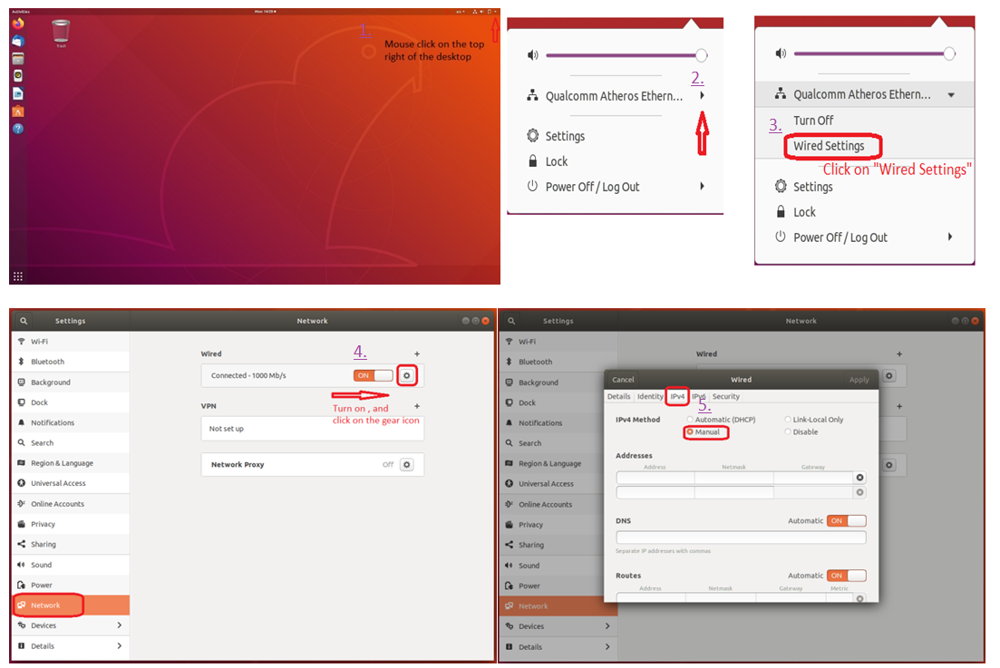
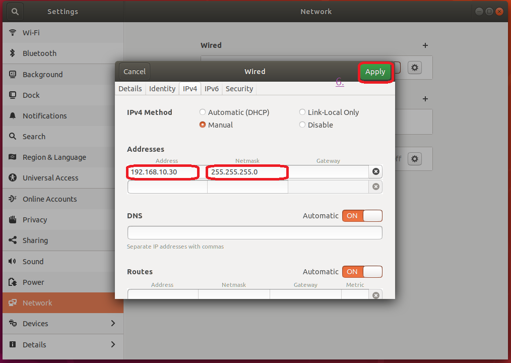
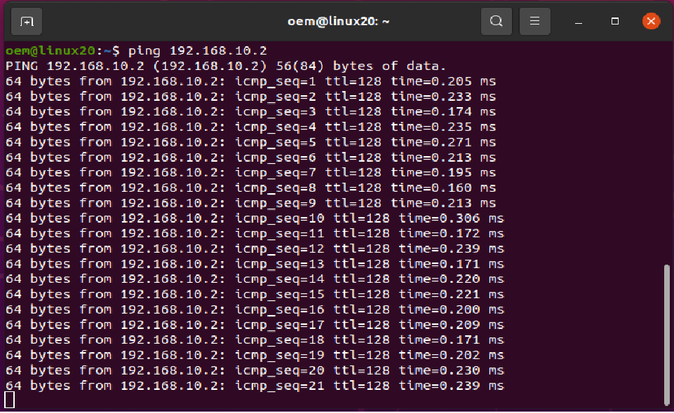

# __TM ROS Driver__

## __1. Overview__

Techman Robot is a state-of-the-art production tool that is highly compatible and flexible to collaboration between human and machine. The Robot Operating System (ROS) provides abundant libraries and tools which can be utilized to reduce the cost of trivial development software tool and build robot applications without struggling. Our TM ROS driver provides nodes for communication with Techman Robot controllers, data including robot states, images from the eye-in-hand camera and URDF models for various robot arms via _TMflow_.

## __2. Feature__

This driver is for <u>**ROS1 Noetic**</u> version. <br/>
For using the driver, please make sure your ROS PC is installed correct.<br/>
If the user want to use ROS2 driver version, please go to [TM ROS2 driver](https://github.com/TechmanRobotInc/tmr_ros2).<br/>


More information: TM ROS driver support list
|ROS Distribution (ROS Environment Setup)|TM ROS driver version|TM ROS Vision|Remark: switch GitHub branches|
|:---|:---|:---:|:---:|
|[**<font color=#808080>ROS Noetic Ninjemys**](http://wiki.ros.org/noetic)|[**<font color=#800000>TM ROS1 Noetic driver**](https://github.com/TechmanRobotInc/tmr_ros1/tree/noetic)|x|noetic|
|[**<font color=#808080>ROS Melodic Morenia**](http://wiki.ros.org/melodic)|[**<font color=#800000>TM ROS1 Melodic driver**](https://github.com/TechmanRobotInc/tmr_ros1/)|x|master|
|[**<font color=#808080>ROS 2 Foxy Fitzroy**](https://index.ros.org/doc/ros2/Releases/Release-Foxy-Fitzroy/)|[**<font color=#0000FF>TM ROS2 Foxy driver**](https://github.com/TechmanRobotInc/tmr_ros2)|supported|master|
|[**<font color=#808080>ROS 2 Dashing Diademata**](https://index.ros.org/doc/ros2/Releases/Release-Dashing-Diademata/)|[**<font color=#0000FF>TM ROS2 Dashing driver**](https://github.com/TechmanRobotInc/tmr_ros2/tree/dashing-devel)|supported|dashing-devel|

Note: The two current master branches are ROS1 Melodic and ROS2 Foxy.<br/>


### __ROS1 Driver__

The TM ROS driver connects to _TMflow Ethernet Slave_ to control _TMflow project_. Robot state is transmitted through this connection.  A working driver also connects to a _Listen node_ (running at a _TMflow project_) at the same time. To control the robot locomotion ,IO ,etc., the TM ROS driver sends robot script (_TM Robot Expression_) through this connection.
More information about _TM Robot Expression_ and _Ethernet Slave_, see [Expression Editor and Listen Node.pdf](https://assets.omron.eu/downloads/manual/en/v1/i848_tm_expression_editor_and_listen_node_reference_manual_en.pdf).
The TM ROS driver for ROS1 is a __single ROS node__ which creates a ROS interface such as topics and services:

> __Action Server__
>
> - An  action interface on _/follow_joint_trajectory_ for seamless integration with MoveIt
>
> __Topic Publisher__
>
> - publish feedback state on _/feedback_states_  
feedback state include robot position, error code, io state, etc.
(see _tm_msgs/msg/FeedbackState.msg_)  
> - publish joint states on _/joint_states_  
> - publish tool pose on _/tool_pose_
>
> __Service Server__
>
> - _/tm_driver/send_script_ (see _tm_msgs/srv/SendScript.srv_) :  
send robot script (_TM Robot Expression_) to _Listen node_  
> - _/tm_driver/set_event_ (see _tm_msgs/srv/SetEvent.srv_) :  
send "Stop", "Pause" or "Resume" command to _Listen node_  
> - _/tm_driver/set_io_ (see _tm_msgs/srv/SetIO.srv_) :  
send digital or analog output value to _Listen node_  
> - _/tm_driver/set_position (see _tm_msgs/srv/SetPosition.srv_) :  
send motion command to _Listen node_, the motion type include PTP, LINE, CIRC ans PLINE, the position value is joint angle(__J__) or tool pose(__T__), see [[Expression Editor and Listen Node.pdf]]
>
>

### __Installation__
Just clone the TM ROS driver of git repository into your working directory and then built it.<br/>
The user can directly refer to the chapters introduced in the following text: steps 1 to 4 of __&sect; Usage with demo code & driver__.<br/>


## __3. Usage__

### &sect; __TMflow Listen node setup__
> The __Listen node__: a socket server can be established and be connected with ROS by an external device to communicate according to the [defined protocol](https://assets.omron.eu/downloads/manual/en/v1/i848_tm_expression_editor_and_listen_node_reference_manual_en.pdf). The user can make the robot communicate with the user's ROS (remote) computer equipment through a wired network, when all the network parameters in the _Network setting_ are set.<br/>
>
> 1. Create a _Listen task_ of flow project of __TMflow__ software, and then drag the __Listen node__ from the _nodes menu_ onto the project flow, as shown below.
> [](https://www.youtube.com/watch?v=LuKE2wVNn5Y)
>
> 2. Set the `Network` settings: mouse-click to enter the page of __System &rArr; Network__ in order.  
Example: Set the Subnet mask: 255.255.255.0 and IP address 192.168.10.2  
Note: Set the network mask, and the communication with the TM Robot must be in the set domain.  
> 
>
> 3. Set the __Ethernet Slave Data Table__ settings: mouse-click to enter the page of __Setting &rArr; Connection &rArr; Ethernet Slave__ in order.   
Enable the `Data Table Setting` item and check the following boxes as item predefined to receive/send specific data:
>
>       - [x] Robot_Error
>       - [x] Project_Run
>       - [x] Project_Pause
>       - [x] Safeguard_A
>       - [x] ESTOP
>       - [x] Camera_Light
>       - [x] Error_Code
>       - [x] Joint_Angle
>       - [x] Coord_Robot_Flange
>       - [x] Coord_Robot_Tool
>       - [x] TCP_Force
>       - [x] TCP_Force3D
>       - [x] TCP_Speed
>       - [x] TCP_Speed3D
>       - [x] Joint_Speed
>       - [x] Joint_Torque
>       - [x] Project_Speed
>       - [x] MA_Mode
>       - [x] Robot Light
>       - [x] Ctrl_DO0~DO7
>       - [x] Ctrl_DI0~DI7
>       - [x] Ctrl_AO0
>       - [x] Ctrl_AI0~AI1
>       - [x] END_DO0~DO3
>       - [x] END_DI0~DI2
>       - [x] END_AI0
>
>       
>
>    Another way to set the __Ethernet Slave Data Table__ settings is to directly import the software package , see [TM ROS Driver vs TMflow software Usage : Import Data Table Setting](https://github.com/TechmanRobotInc/TM_Export).
>  
> 4. Press the Play/Pause Button on the Robot Stick to start running this _Listen task_ project.
>
>     Note: Software TMflow version changes may have slightly different settings.([SW1.76_Rev2.00](https://www.tm-robot.com/zh-hant/wpdmdownload/software-manual-tmflow_sw1-76_rev2-00/)) ([SW1.82_Rev1.00](https://www.tm-robot.com/zh-hant/wpdmdownload/software-manual-tmflow_sw1-82_rev1-00/))<br/>


###  &sect; __Remote connection to TM ROBOT__
> Static IP of remote connection network settings through the wired network .<br/> 
>
> 1. Set the wired network of the user's (remote) Ubuntu computer by mouse-click on the top right of the desktop &rArr; Click on "Wired Settings" &rArr; Click on the gear icon &rArr; In the IPv4 feature options, click on "Manual" in order.<br/> 
> 
> 2. Set the Static IP settings: where the IP address is fixed for the first three yards same as the previous setting 192.168.10, last yards 3-254 machine numbers are available. (Because _TM ROBOT_, you have been set to 192.168.10.2 )<br/> 
> Example: Set the Netmask: 255.255.255.0 and IP address 192.168.10.30  <br/> 
> 
> 3. Check Internet connection: start a terminal to test the connectivity with the target host _TM ROBOT_, by typing ping 192.168.10.2
> 


###  &sect; __TM ROS driver usage__

> __ROS1 driver usage__
> 
> After the user has set up the ROS1 environment and built the TM driver based on the specific workspace, please enter your workspace `<workspace>` by launching the terminal, and remember to make the workspace visible to ROS.
>
>
> ```bash
> source /opt/ros/noetic/setup.bash
> cd <workspace>
> source ./devel/setup.bash
> ```
> :bulb: Do you prepare the __TM Robot__ ready ? Make sure that TM Robot's operating software (__TMflow__) network settings are ready and the __Listen node__ is running. 
> 
> Then, run the driver to maintain the connection with TM Robot by typing 
>
>```bash
> rosrun tm_driver tm_driver <robot_ip_address>
>```
> Example :``rosrun tm_driver tm_driver 192.168.10.2``, if the <robot_ip_address> is 192.168.10.2
>
>
> Another way, the user can execute the specific existing launch file (example: __tm5_900_bringup.launch__) to enable the driver to connect to __tm5-900__ robot  
>
> ```bash
> roslaunch tm_driver tm5_900_bringup.launch robot_ip:=<robot_ip_address>
> ```
> Example :``roslaunch tm_driver tm5_900_bringup.launch robot_ip:=192.168.10.2``, if the <robot_ip_address> is 192.168.10.2
>
> Now, the user can use a new terminal to run each ROS node or command, but don't forget to source the correct setup shell files as starting a new terminal.

> __Usage with MoveIt__ 
>
> See [Moveit tutorial](https://ros-planning.github.io/moveit_tutorials/).<br/>
>
> To bring up MoveIt environment in simulation mode with virtual TM Robot, by typing
>
>
> ```bash
> roslaunch tm5_900_moveit_config tm5_900_moveit_planning_execution.launch sim:=True
> ```
>
> The user can also manipulate TM Robot in the real world, by typing<br/>
> :bulb: Do you prepare the __TM Robot__ ready ? Make sure that TM Robot's operating software (__TMflow__) network settings are ready and the __Listen node__ is running.  
>
> ```bash
> roslaunch tm5_900_moveit_config tm5_900_moveit_planning_execution.launch sim:=False robot_ip:=<robot_ip_address>
> ```
>
> The parameter `<robot_ip_address>` means the IP address of the TM Robot.<br/>
>:warning:[CAUTION] This demo will let the real TM Robot move, please be careful.<br/>


## __4. Program script demonstration__

### &sect; __Demo package description__
> There are some demo codes showing  how to use TM ROS driver.<br/>
>
> * demo_send_script:<br/>
In this demo code, it shows how to send a __Listen node__ script to control the TM Robot. <br/>
The user can use service named "send_script" to send script.<br/>
"id" &rarr; The transaction number expressed in any <u>alphanumeric</u> <sup>1</sup> characters.<br/> 
"script" &rarr; the script which the user want to send.<br/>
"ok" &rarr; the correctness of the script.<br/>
 ><sup>1</sup> If a non-alphanumeric byte is encountered, a CPERR 04 error is reported. When used as a communication packet response, it is a transaction number and identifies which group of commands to respond.<br/>
>
> * demo_ask_item:<br/>
In this demo code, the user can use this service to send TMSCT <sup>2</sup> cmd.<br/> 
> <sup>2</sup> For more detailed information, please refer to _defined protocol_: Expression Editor and Listen Node.pdf (Chapter7.4 TMSCT)<br/>
>
> * demo_ask_sta:<br/>
In this demo code, the user can use this service to send TMSTA <sup>3</sup> cmd.<br/>
> <sup>3</sup> For more detailed information, please refer to _defined protocol_ (Chapter7.5 TMSTA)<br/>
> * demo_connect_tm:<br/>
In this demo code, the user can set the connection type. <br/>
If the user sets reconnect to true, every time the driver disconnects from the __Listen node__, it will try to reconnect.<br/>
There are two kind connection settings the user can select, one is "connect_tmsvr" for Ethernet server connection, and the other is "connect_tmsct" for  TMflow connection.<br/>
>
> * demo_set_event:<br/>
In this demo code, six event types can be selected.<br/> 
func &rarr;  TAG, WAIT_TAG, STOP, PAUSE, RESUME and EXIT<br/>
arg0 &rarr;  if func is TAG or WAIT_TAG, arg0 is timeout in ms<br/>
arg1 &rarr;  if func is TAG or WAIT_TAG, arg1 is id<br/>
>
> * demo_set_io:<br/>
In this demo code, the user should set module, type, pin and state. <sup>4</sup> <br/>
module &rarr;  MODULE_CONTROLBOX or MODULE_ENDEFFECTOR<br/>
type &rarr;  TYPE_DIGITAL_IN, TYPE_DIGITAL_OUT, TYPE_INSTANT_DO, TYPE_ANALOG_IN, TYPE_ANALOG_OUT, TYPE_INSTANT_AO<br/>
pin &rarr;  pin number<br/>
state &rarr;  STATE_OFF or STATE_ON value, or other value (if type expressed in a specific control module)<br/>
> <sup>4</sup> For more detailed information, please refer to _defined protocol_ (Chapter6.5 IO)<br/>
>
> * demo_set_positions:<br/>
In this demo code, the user should pay attention to the parameter definition of the data format setting <sup>5</sup> and the unit of the parameter to be operated.  <br/>
motion_type &rarr;  PTP_J , PTP_T , LINE_J , LINE_T , CIRC_J ,CIRC_T , PLINE_J ,PLINE_T <br/>
positions &rarr;  motion target position: If expressed in Cartesian coordinate (unit: m), if expressed in joint angles (unit: rad)<br/>
velocity &rarr;  motion velocity: if expressed in Cartesian coordinate (unit: m/s) <sup>6</sup> , if expressed in joint velocity (unit: rad/s, and the maximum value is limited to  &pi; )  <sup>6</sup>  <br/>
acc_time &rarr; time to reach maximum speed (unit: ms)<br/> 
blend_percentage &rarr; blending value: expressed as a percentage (unit: %, and the minimum value of 0 means no blending) <br/>
fine_goal &rarr; precise position mode : If activated, the amount of error in the final position will converge more, but it will take a few more milliseconds.<br/>
> <sup>5</sup> For more detailed information, please refer to _defined protocol_ (Chapter8 PTP, Line, Circle, Pline, Move_PTP, Move_Line, Move_PLine) <br/>
> <sup>6</sup> The unit of the parameters are different, the user can find the conversion in the program of TM ROS driver.<br/>
>
> * demo_write_item: <br/>
In this demo code, the user can use this service to send TMSVR <sup>7</sup> cmd. <br/>
> <sup>7</sup> For more detailed information, please refer to _defined protocol_ (Chapter9.3 svr_write())<br/>
>
> * demo_leave_listen_node:<br/>
In this demo code, the user can use send_script service sending a script to leave the __Listen node__.<br/>
> :bulb: If the user has sent the demo_leave_listen_node script to leave the __Listen node__, and you want to run the TM Robot again, please remember that the _Listen task_ project should be resumed to run. You can press the Stop Button on the Robot Stick and then press the Play/Pause Button to resume operation. <br/>


### &sect; __Usage with demo code & driver__
> Note: If the user have even successfully built a specific code(tmr_ros1), the user only need to change to the TM driver workspace path  ``cd ~/tmdriver_ws`` , and then directly refer to steps 5~7 below. <br/>
> 1. Type to create a root workspace directory by starting a terminal: For example,  ``tmdriver_ws`` or ``catkin_ws``, then type to change current directory into the workspace directory path.<br/>
``mkdir ~/tmdriver_ws``<br/>
``cd ~/tmdriver_ws``<br/>
> 2. Clone the the TM driver of git repository into the current directory by typing<br/>
``git clone https://github.com/TechmanRobotInc/tmr_ros1.git -b noetic``<br/>
or<br/>
``git clone -b noetic https://github.com/TechmanRobotInc/tmr_ros1.git``<br/>
> 3. After the download done, rename the download folder ``tmr_ros1``(or ``tmr_ros1-noetic``) to ``src`` by typing<br/>
``mv tmr_ros1 src``<br/>  (or right-click on the download folder, select "Rename...")<br/>
> 4. At the workspace directory to build the download packages and source 'setup.bash' in this workspace to make the worksapce visible to ROS of this terminal 1.<br/>
Note: Do you set``source /opt/ros/noetic/setup.bash`` ready? Make sure to obtain the correct setup file according to your workspace hierarchy, and then type the following below to compile.<br/>
``catkin_make``<br/>
``source ./devel/setup.bash``<br/>
> 5. Terminal 1: Startup ROS core  and type<br/>
``roscore``<br/>
> 6. In a new terminal 2: Source setup.bash in the workspace path and run the driver to connect to TM Robot by typing<br/>
``source ./devel/setup.bash``<br/>
``rosrun tm_driver tm_driver <robot_ip_address>``<br/>
The <robot_ip_address> is the IP address of the TM Robot, the user can get it through TM Flow, for example 192.168.10.2<br/>
> 7. In another new terminal: Source setup.bash in the workspace path and type specific demo node function which the user want to study for applications. For example: the user select to run demo_set_io, the user can type<br/>
``source ./devel/setup.bash``<br/>
``rosrun demo demo_set_io``<br/>
>:warning:[CAUTION] Some demos will let the TM Robot move, please be careful.<br/>
><br/>


## __5. TM GUI debugging and demonstration__
The GUI displays tm_driver connection status, sct, sta, svr messages and robot status. Easily judge the message between the driver and the robot through the GUI display. If the connection fails, the user can also try to send a reconnect command on this GUI for debugging.


### &sect; GUI Debugging description
> * If the user forgets to run the TM ROS driver, the user will see all the controlled label items of the GUI are displayed as "NaN".<br/>
> * The user can click "``Quit_GUI``" button or click the "``x``" close button in the upper right corner to close this GUI.<br/>
> * If "``Ethernet``" and "``Listen Node``" connection display are "on", it means that ROS SvrClient and SctClient are successfully connected.<br/>
> * If "``Ethernet``" connection display is is "off", the user should check whether the TM Robot has been started or whether the network settings are correct.<br/>
> * If "``Listen Node``" connection is "off", the user should check whether the task project is running.<br/>
> :bulb: If "``Listen Node``" connection is interrupted as "``Project_Run``" is stopped, the "``Listen Node``" connection will be "off". <br/>
> * If both "``Ethernet``" and "``Listen Node``" connection display  are "on", but the "``Robot_Link``" is false or "``Robot_Error``" is true; this means the robot is working abnormally, or maybe the ESTOP button was pressed or or some kind of protection or error <sup>1</sup> occurred. Therefore, when the user sends a move script command at this time, it will not work.<br/> 
> <sup>1</sup> For more detailed information, please refer to the TM Robot User Guide.<br/> 
> * The user can use the self-developed script to read/write project data through communication protocols to control the TM Robot. If it does not work properly, the user can quickly determine whether there is a communication error code by viewing the "``Response ROS Node Status``" display.<br/>
> * When the user sends a command or clicks DO0 Ctrl "``H/L``" button of Control_Box, the user also can see the response message <sup>2</sup> embedded in the "``Robot Response``" item view.<br/>
> <sup>2</sup> For details of this item, please refer to __SctResponse.msg__, __StaResponse.msg__ and __SvrResponse.msg__ of TM ROS driver code.<br/>
> * The user can click "``clear``" button to clear the old response message.<br/>
> :bulb: If "``Ethernet``" connection is interrupted, the display of most controlled label items in the GUI will be displayed as "NaN" and the robot feedback state will remain the last state and become invalid.<br/>


### &sect; Usage with GUI debugging
> Note: If the user have even successfully built a specific code(tmr_ros1), the user only need to change to the TM driver workspace path  ``cd ~/tmdriver_ws`` , and then directly refer to steps 5~7 below. <br/>
> 1. Type to create a root workspace directory by starting a terminal: For example,  ``tmdriver_ws`` or ``catkin_ws``, then type to change current directory into the workspace directory path.<br/>
``mkdir ~/tmdriver_ws``<br/>
``cd ~/tmdriver_ws``<br/>
> 2. Clone the the TM driver of git repository into the current directory by typing<br/>
``git clone https://github.com/TechmanRobotInc/tmr_ros1.git -b noetic``<br/>
> 3. After the download done, rename the download folder ``tmr_ros1``(or ``tmr_ros1-noetic``) to ``src`` by typing<br/>
``mv tmr_ros1 src``<br/>  (or right-click on the download folder, select "Rename...")<br/>
> 4. At the workspace directory to build the download packages and source 'setup.bash' in this workspace to make the worksapce visible to ROS of this terminal 1.<br/>
Note: Do you set``source /opt/ros/noetic/setup.bash`` ready? Make sure to obtain the correct setup file according to your workspace hierarchy, and then type the following below to compile.<br/>
``catkin_make``<br/>
``source ./devel/setup.bash``<br/>
> 5. Terminal 1: Startup ROS core  and type<br/>
``roscore``<br/>
> 6. In a new terminal 2: Source setup.bash in the workspace path and run the driver to connect to TM Robot by typing<br/>
``source ./devel/setup.bash``<br/>
``rosrun tm_driver tm_driver <robot_ip_address>``<br/>
The <robot_ip_address> is the IP address of the TM Robot, the user can get it through TM Flow, for example 192.168.10.2<br/>
> 7. In another new terminal 3: Source setup.bash in the workspace path and start GUI debug by typing<br/>
``source ./devel/setup.bash``<br/>
``rosrun ui_for_debug_and_demo robot_ui``<br/>

