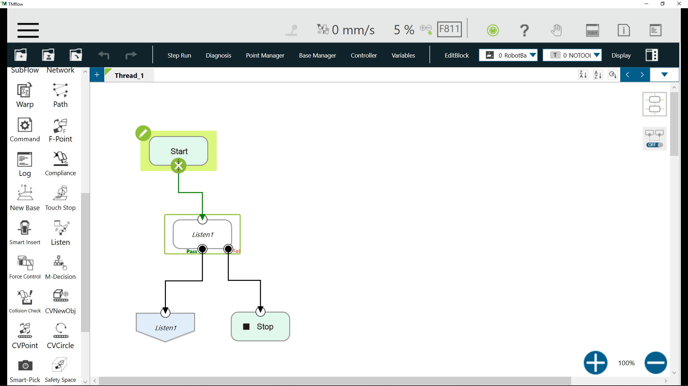
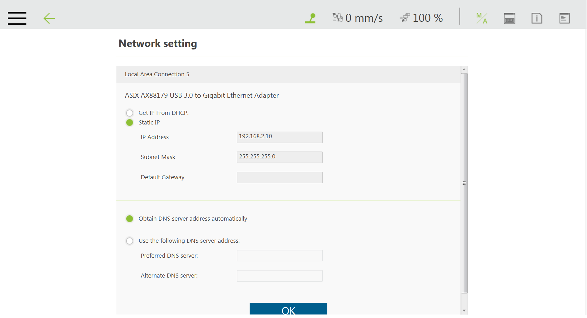
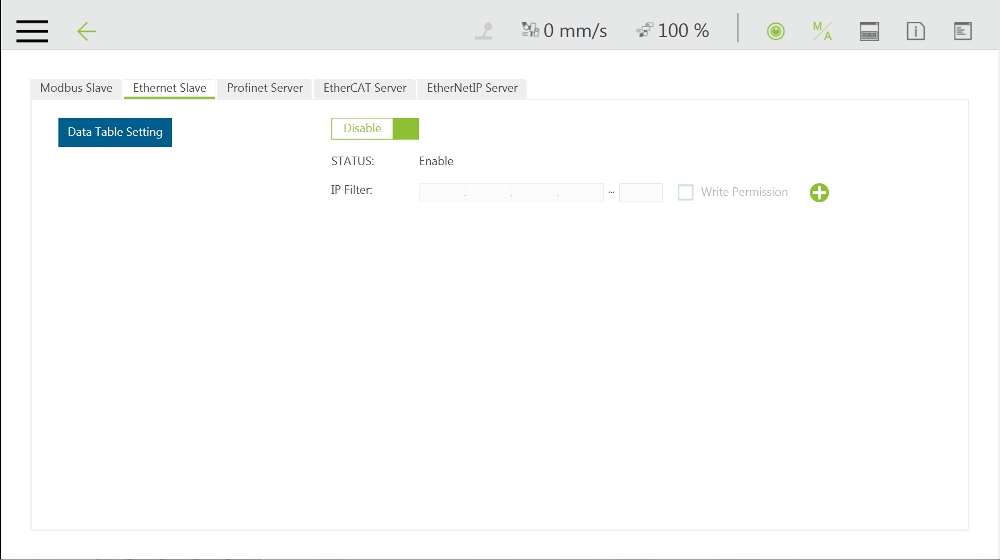

# __TM ROS Driver__

## __1. Overview__

Techman Robot is a state-of-the-art production tool that is highly compatible and flexible to collaboration between human and machine. The Robot Operating System (ROS) provides abundant libraries and tools which can be utilized to reduce the cost of trivial development software tool and build robot applications without struggling. Our TM ROS driver provides nodes for communication with Techman Robot controllers, data including robot states, images from the eye-in-hand camera and URDF models for various robot arms via _TMflow_.

## __2. Feature__

This driver is for <u>**ROS1 Melodic**</u> version. <br/>
For using the driver, please make sure your ROS PC is installed correct.<br/>
If the user want to use ROS2 driver version, please go to [TM ROS2 driver](https://github.com/TechmanRobotInc/tmr_ros2).<br/>


More information: TM ROS driver list
|ROS Distribution (ROS Environment Setup)|TM ROS driver version|TM ROS Vision|Remark: switch GitHub branches|
|:---|:---|:---:|:---:|
|[**<font color=#808080>ROS Noetic Ninjemys**](http://wiki.ros.org/noetic)|[**<font color=#800000>TM ROS1 Noetic driver**](https://github.com/TechmanRobotInc/tmr_ros1/tree/noetic)|x|noetic|
|[**<font color=#808080>ROS Melodic Morenia**](http://wiki.ros.org/melodic)|[**<font color=#800000>TM ROS1 Melodic driver**](https://github.com/TechmanRobotInc/tmr_ros1/)|x|master|
|[**<font color=#808080>ROS 2 Foxy Fitzroy**](https://index.ros.org/doc/ros2/Releases/Release-Foxy-Fitzroy/)|[**<font color=#0000FF>TM ROS2 Foxy driver**](https://github.com/TechmanRobotInc/tmr_ros2)|supported|master|
|[**<font color=#808080>ROS 2 Dashing Diademata**](https://index.ros.org/doc/ros2/Releases/Release-Dashing-Diademata/)|[**<font color=#0000FF>TM ROS2 Dashing driver**](https://github.com/TechmanRobotInc/tmr_ros2/tree/dashing-devel)|supported|dashing-devel|

Note: The two current master branches are ROS1 Melodic and ROS2 Foxy.<br/>


### __ROS1 Driver__

The TM ROS driver connects to _TMflow Ethernet Slave_ to control _TMflow project_. Robot state is transmitted through this connection.  A working driver also connects to a _Listen node_ (running at a _TMflow project_) at the same time. To control the robot locomotion ,IO ,etc., the TM ROS driver sends robot script (_TM Robot Expression_) through this connection.
More information about _TM Robot Expression_ and _Ethernet Slave_, see [Expression Editor and Listen Node.pdf]
The TM ROS driver for ROS1 is a __single ROS node__ which creates a ROS interface such as topics and services:

> __Action Server__
>
> - An  action interface on _/follow_joint_trajectory_ for seamless integration with MoveIt
>
> __Topic Publisher__
>
> - publishes feedback state on _/feedback_states_  
feedback state include robot position, error code, io state, etc.
(see _tm_msgs/msg/FeedbackState.msg_)  
> - publishes joint states on _/joint_states_  
> - publishes tool pose on _/tool_pose_
>
> __Service Server__
>
> - _/tm_driver/send_script_ (see _tm_msgs/srv/SendScript.srv_) :  
send robot script (_TM Robot Expression_) to _Listen node_  
> - _/tm_driver/set_event_ (see _tm_msgs/srv/SetEvent.srv_) :  
send "Stop", "Pause" or "Resume" command to _Listen node_  
> - _/tm_driver/set_io_ (see _tm_msgs/srv/SetIO.srv_) :  
send digital or analog output value to _Listen node_  
> - _/tm_driver/set_position (see _tm_msgs/srv/SetPosition.srv_) :  
send motion command to _Listen node_, the motion type include PTP, LINE, CIRC ans PLINE, the position value is joint angle(__J__) or tool pose(__T__), see [[Expression Editor and Listen Node.pdf]]
>
>


## __3. Usage__

### __TMflow Listen node setup__
> The Listen node: a socket server can be established and be connected with ROS by an external device to communicate according to the defined protocol.
>
> 1. Create a flow project; then choose the __Listen__ node and the __Goto__ node
> [](https://www.youtube.com/watch?v=LuKE2wVNn5Y)
>
> 2. Go to the __System/Network setting__ page  
Type network parameters of device for ROS
> 
>
> 3. Go to the __Setting/Connection__ page  
Enable the __Ethernet Slave__ item  
Click on the __Data Table Setting__ button and check the following boxes:
>
>       - [x] Robot_Error
>       - [x] Project_Run
>       - [x] Project_Pause
>       - [x] Safeguard_A
>       - [x] ESTOP
>       - [x] Camera_Light
>       - [x] Error_Code
>       - [x] Joint_Angle
>       - [x] Coord_Robot_Flange
>       - [x] Coord_Robot_Tool
>       - [x] TCP_Force
>       - [x] TCP_Force3D
>       - [x] TCP_Speed
>       - [x] TCP_Speed3D
>       - [x] Joint_Speed
>       - [x] Joint_Torque
>       - [x] Project_Speed
>       - [x] MA_Mode
>       - [x] Robot Light
>       - [x] Ctrl_DO0~DO7
>       - [x] Ctrl_DI0~DI7
>       - [x] Ctrl_AO0
>       - [x] Ctrl_AI0~AI1
>       - [x] END_DO0~DO3
>       - [x] END_DI0~DI2
>       - [x] END_AI0
>
>       
>
>
> Note: Software TMflow version changes may have slightly different settings.([SW1.76_Rev2.00](https://www.tm-robot.com/zh-hant/wpdmdownload/software-manual-tmflow_sw1-76_rev2-00/)) ([SW1.82_Rev1.00](https://www.tm-robot.com/zh-hant/wpdmdownload/software-manual-tmflow_sw1-82_rev1-00/))<br/>


### __TM ROS driver usage__

> __ROS1 driver usage__
> 
> After the user has set up the ROS1 environment and built the TM driver based on the specific workspace, please enter your workspace `<workspace>` by launching the terminal, and remember to make the workspace visible to ROS.
>
>
> ```bash
> source /opt/ros/melodic/setup.bash
> cd <workspace>
> source ./devel/setup.bash
> ```
> :warning: Do you prepare __TM Robot__ ready ? Make sure that TM Robot's operating software (__TMflow__) system/network settings are ready and the __Listen node__ is running. 
> 
>Then, run the driver to maintain the connection with TM Robot by typing 
>
>```bash
>rosrun tm_driver tm_driver <robot_ip_address>
>```
>Example :``rosrun tm_driver tm_driver 192.168.10.2``, if the <robot_ip_address> is 192.168.10.2
>
>
> Another way, the user can execute the specific existing launch file (example: __tm5_900_bringup.launch__) to enable the driver to connect to __tm5-900__ robot  
>
> ```bash
> roslaunch tm_driver tm5_900_bringup.launch robot_ip:=<robot_ip_address>
> ```
>Example :``roslaunch tm_driver tm5_900_bringup.launch robot_ip:=192.168.10.2``, if the <robot_ip_address> is 192.168.10.2
>
>Now, the user can use a new terminal to run each ROS node or command, but don't forget to source the correct setup shell files as starting a new terminal.

> __Usage with MoveIt__ 
>
> See [Moveit tutorial](http://docs.ros.org/en/melodic/api/moveit_tutorials/html/doc/getting_started/getting_started.html).<br/>
>
>To bring up MoveIt environment in simulation mode with virtual TM Robot, by typing
>
>
> ```bash
> roslaunch tm5_900_moveit_config tm5_900_moveit_planning_execution.launch sim:=True
> ```
>
> The user can also manipulate TM Robot in the real world, by typing<br/>
> :warning: Do you prepare __TM Robot__ ready ? Make sure that TM Robot's operating software (__TMflow__) system/network settings are ready and the __Listen node__ is running.  
>
> ```bash
> roslaunch tm5_900_moveit_config tm5_900_moveit_planning_execution.launch sim:=False robot_ip:=<robot_ip_address>
> ```
>
> The parameter `<robot_ip_address>` means the IP address of the TM Robot.<br/>
>[CAUTION]:warning: This demo will let the real TM Robot move, please be careful.<br/>


## __4. Code of Demo__
There are some demo codes showing  how to use this driver.

> 1. demo_send_script:<br/>
In this demo code, it shows how to send a Listen node script to control the TM Robot. <br/>
The user can use service named "send_script" to send script.<br/>
"id"->The transaction number expressed in any alphanumeric characters . (Reports the CPERR 04 error if a non-alphanumeric byte is encountered .  When used as a communication packet response , it is a transaction number and identifies which group of commands to respond.<br/>
"script"-> the script which the user want to send.<br/>
"ok" -> Correctness of the script.
> 2. demo_ask_item:<br/>
In this demo code, the user can use this service to send TMSCT cmd. More details please refer to the Expression Editor and Listen Node.pdf(Chapter7.4 TMSCT)<br/>
> 3. demo_ask_sta:<br/>
In this demo code, the user can use this service to send TMSTA cmd. More details please refer to the Expression Editor and Listen Node.pdf(Chapter7.5 TMSTA)<br/>
> 4. demo_connect_tm:<br/>
In this demo code, the user can set the connection type. <br/>
If the user set to reconnect as true, every time when driver disconnects from Listen node, it will try to re-connect it.<br/>
There are two kind connection settings the user can select, one is "connect_tmsvr" for Ethernet server connection, and the other is "connect_tmsct" for setting TM-Flow connection.<br/>
> 5. demo_set_event:<br/>
In this demo code, six event types can be selected.<br/> 
func: TAG, WAIT_TAG, STOP, PAUSE, RESUME and EXIT<br/>
arg0: if func is TAG or WAIT_TAG, arg0 is timeout in ms<br/>
arg1: if func is TAG or WAIT_TAG, arg1 is id<br/>
> 6. demo_set_io:<br/>
In this demo code, the user should set module, type, pin and state. More details please refer to the Expression Editor and Listen Node.pdf(Chapter6.5 IO)<br/>
module : MODULE_CONTROLBOX or MODULE_ENDEFFECTOR<br/>
type: TYPE_DIGITAL_IN, TYPE_DIGITAL_OUT, TYPE_INSTANT_DO, TYPE_ANALOG_IN, TYPE_ANALOG_OUT, TYPE_INSTANT_AO<br/>
pin: pin number<br/>
state: STATE_OFF or STATE_ON or other value(if digitial IO)<br/>
> 7. demo_set_positions:<br/>
In this demo, the user should be careful with parameter units to operation.<br/>
motion_type : PTP_J , PTP_T , LINE_J , LINE_T , CIRC_J ,CIRC_T , PLINE_J ,PLINE_T.  More details please refer to the Expression Editor and Listen Node.pdf(Chapter8 PTP, Line, Circle, Pline, Move_PTP, Move_Line, Move_PLine) <br/>
positions : target position or target joint(rad)<br/>
velocity : joint velocity-> max value is Pi -> 3.14 rad/s , line velocity ->m/s <br/>
acc_time : to max speed time in millisecond<br/>
blend_percentage : 0 has no blending
fine_goal : In a real situation, the controller will check the erro of the final position and should wait a few milliseconds.<br/>
> 8. demo_write_item: <br/>
In this demo code, the user can use this service to send TMSVR cmd. More details please refer to the Expression Editor and Listen Node.pdf(Chapter9.3 svr_write())
> 9. demo_leave_listen_node:<br/>
In this demo code, the user can use send_script service sending a script to leave the listen node.<br/>


## Usage with demo code & driver
> Note: If the user have even successfully built a specific code(tmr_ros1), the user only need to change to the TM driver workspace path  ``cd ~/tmdriver_ws`` , and then directly refer to steps 5~7 below. <br/>
> 1. Type to create a root workspace directory by starting a terminal: For example,  ``tmdriver_ws`` or ``catkin_ws``, then type to change current directory into the workspace directory path.<br/>
``mkdir ~/tmdriver_ws``<br/>
``cd ~/tmdriver_ws``<br/>
> 2. Clone the the TM driver of git repository into the current directory by typing<br/>
``git clone https://github.com/TechmanRobotInc/tmr_ros1.git``<br/>
> 3. After the download done, rename the download folder ``tmr_ros1``(or ``tmr_ros1-master``) to ``src`` by typing<br/>
``mv tmr_ros1 src``<br/>  (or right-click on the download folder, select "Rename...")<br/>
> 4. At the workspace directory to build the download packages and source 'setup.bash' in this workspace to make the worksapce visible to ROS of this terminal 1.<br/>
Note: Do you set``source /opt/ros/melodic/setup.bash`` ready? Make sure to obtain the correct setup file according to your workspace hierarchy, and then type the following below to compile.<br/>
``catkin_make``<br/>
``source ./devel/setup.bash``<br/>
> 5. Terminal 1: Startup ROS core  and type<br/>
``roscore``<br/>
> 6. In a new terminal 2: Source setup.bash in the workspace path and run the driver to connect to TM Robot by typing<br/>
``source ./devel/setup.bash``<br/>
``rosrun tm_driver tm_driver <robot_ip_address>``<br/>
The <robot_ip_address> is the IP address of the TM Robot, the user can get it through TM Flow, for example 192.168.10.2<br/>
> 7. In another new terminal: Source setup.bash in the workspace path and type specific demo node function which the user want to study for applications. For example: the user select to run demo_set_io, the user can type<br/>
``source ./devel/setup.bash``<br/>
``rosrun demo demo_set_io``<br/>
>[CAUTION]:warning: Some demos will let the robot move, please be careful.<br/>
><br/>
>Note:  The user also can add your workspace to the .bashrc such that it is sourced every time you start a new terminal.<br/>
``echo "source ~/tmdriver_ws/devel/setup.bash" >> ~/.bashrc``<br/>


## TM GUI debugging and demonstration
The GUI displays tm_driver connection status, sct, sta, svr messages and robot status. Easily judge the message between the driver and the robot through the GUI display. If the connection fails, the user can also try to send a reconnect command on this GUI for debugging.


### Usage with TM GUI debugging
> Note: If the user have even successfully built a specific code(tmr_ros1), the user only need to change to the TM driver workspace path  ``cd ~/tmdriver_ws`` , and then directly refer to steps 5~7 below. <br/>
> 1. Type to create a root workspace directory by starting a terminal: For example,  ``tmdriver_ws`` or ``catkin_ws``, then type to change current directory into the workspace directory path.<br/>
``mkdir ~/tmdriver_ws``<br/>
``cd ~/tmdriver_ws``<br/>
> 2. Clone the the TM driver of git repository into the current directory by typing<br/>
``git clone https://github.com/TechmanRobotInc/tmr_ros1.git``<br/>
> 3. After the download done, rename the download folder ``tmr_ros1``(or ``tmr_ros1-master``) to ``src`` by typing<br/>
``mv tmr_ros1 src``<br/>  (or right-click on the download folder, select "Rename...")<br/>
> 4. At the workspace directory to build the download packages and source 'setup.bash' in this workspace to make the worksapce visible to ROS of this terminal 1.<br/>
Note: Do you set``source /opt/ros/melodic/setup.bash`` ready? Make sure to obtain the correct setup file according to your workspace hierarchy, and then type the following below to compile.<br/>
``catkin_make``<br/>
``source ./devel/setup.bash``<br/>
> 5. Terminal 1: Startup ROS core  and type<br/>
``roscore``<br/>
> 6. In a new terminal 2: Source setup.bash in the workspace path and run the driver to connect to TM Robot by typing<br/>
``source ./devel/setup.bash``<br/>
``rosrun tm_driver tm_driver <robot_ip_address>``<br/>
The <robot_ip_address> is the IP address of the TM Robot, the user can get it through TM Flow, for example 192.168.10.2<br/>
> 7. In another new terminal 3: Source setup.bash in the workspace path and start GUI debug by typing<br/>
``source ./devel/setup.bash``<br/>
``rosrun ui_for_debug_and_demo robot_ui``<br/>


### Debugging description
> * If ``is_srv_connect`` and ``is_sct_connect`` are true, it means that all connection is success.<br/>
> * If ``is_srv_connect`` is false, the user should check whether the data table is correct.<br/>
> * If ``is_sct_connect`` is false, the user should check whether the project is running.<br/>
> * If ``is_srv_connect`` and ``is_sct_connect`` are true, and the ``robot link`` is false, it means that the driver has connected to the TM project, but the TMflow Listen node is set to abnormal. Therefore, when the user send the move command, it does not work.<br/>
> * When the user send a command or click ``"change control box IO"``,  the user will see a response item embedded in the ``Robot Response``. For details of this item, please refer to ``SctResponse.msg``, ``StaResponse.msg`` and ``SvrResponse.msg``.<br/>
> * The user can click ``"clear"`` to clear the old response items.<br/>
> * If the user forget to run the ``tm_ros_driver``, the user will see all items displayed as ``"Not ini"``.<br/>